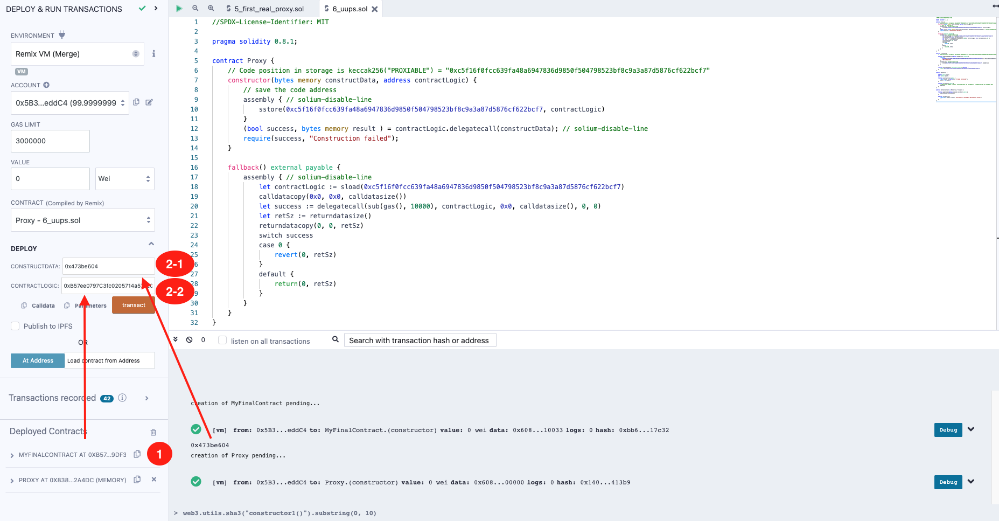
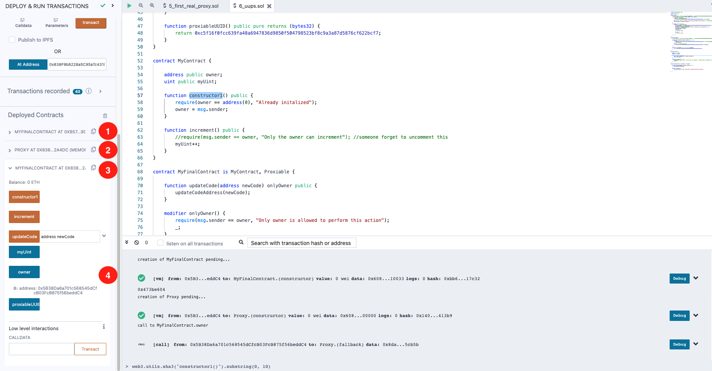

## EIP-1822 : Proxies without Storage Collision without common Storage Contracts (번역_한글)
- 출처 : https://ethereum-blockchain-developer.com/110-upgrade-smart-contracts/08-eip-1822-uups/

[EIP-1822](./eip_1822_universal_upgradeable_proxy_standard_uups.md) : 범용 업그레이드 가능한 프록시 표준(UUPS)은 컴파일러가 어떤 Storage Slot을 사용할지 알려주는 일반적인 Storage 컨트랙트가 필요 없는 영리한 솔루션입니다.
즉, 매소드들 대신 랜덤 Storage Slot을 사용해 로직 컨트랙트 주소를 저장합니다. 

예제를 보여드리기 전에, 중요한 두 줄이 있습니다. 

sstore(0xc5f16f0fcc639fa48a6947836d9850f504798523bf8c9a3a87d5876cf622bcf7, contractLogic) 와 let contractLogic := sload(0xc5f16f0fcc639fa48a6947836d9850f504798523bf8c9a3a87d5876cf622bcf7) 입니다. 

어셈블리에서 특정 Storage Slot에 변수를 저장한 다음 해당 슬롯에서 다시 로드할 수 있습니다. 이 경우, EIP-1822는 keccak256("PROXIABLE") = "0xc5f16f0fcc639fa48a6947836d9850f504798523bf8c9a3a87d5876cf622bcf7"을 사용하여 Storage Slot을 생성합니다. 100% 무작위는 아니지만 충돌이 발생하지 않도록 충분히 무작위입니다. 적어도 정상적인 상황에서는요. [솔리디티의 스토리지 변수 레이아웃](https://docs.soliditylang.org/en/v0.8.2/internals/layout_in_storage.html#layout-of-state-variables-in-storage)을 자세히 살펴보면 충돌이 발생할 가능성이 거의 없음을 알 수 있습니다.

EIP-1822를 사용한 전체 예제는 다음과 같습니다 ([코드](../6_uups.sol))

실행순서는 다음과 같습니다. 

1. `MyFinalContract` 컨트랙트를 배포합니다. 
2. contractLogic는 `MyFinalContract` 컨트랙트 주소를, contructData는 `bytes4(keccak256("constructor1()"))` 로 Proxy 를 배포합니다. 이는 Remix 콘솔에서 `web3.utils.sha3("constructor1()").substring(0, 10)` 를 사용할 수 있습니다. 아래 그림을 참조하세요



3. 그런 다음 Proxy 컨트랙트 주소에서 MyFinalContract가 실행 중이라고 Remix에 알리기만 하면 됩니다. 이전과 마찬가지로요.



보시다시피, 각 과정을 진행하면 컨트랙트는 Storage Slot 0에서 시작할 수 있기 때문에 Storage 상속을 무시하고 어떤 컨트랙트도 상속할 수 있는 MyFinalContract의 로직을 인식하게 됩니다.

변경 사항이 있다면, 새 버전의 `MyFinalContract` 컨트랙트를 배포한 다음 Proxy를 새 주소로 업데이트하세요.

```
변수 삭제는 불가능합니다. 

한 가지 중요한 점은 이전에 정의한 변수를 제거하거나 혼합할 수 없다는 것입니다. 문제는 변수가 여전히 프록시 컨트랙트의 특정 Storage Slot(로직 컨트랙트의 범위로 끌어온)에 존재한다는 것입니다.
변수를 제거하면 솔리디티 컴파일러는 단순히 다음 변수가 이전 변수의 위치에 있다고 가정합니다. Storage가 다시 충돌하게 됩니다.
```

이미 꽤 잘 구현되어 있습니다! 여기서 유일한 문제는 Storage Slot이 실제로 표준화되어 있지 않다는 것입니다. 즉, Logic 컨트랙트 주소를 저장할 Storage Slot을 원하는 대로 선택할 수 있다는 뜻입니다.

이는 블록 탐색기의 경우 사용자에게 정보를 표시하고 조치를 취하기가 매우 어렵게 만듭니다.

EIP-1967에 오신 것을 환영합니다...