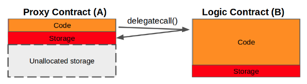

## EIP-1822 : Universal Upgradeable Proxy Standard (UUPS)
- 출처 : https://eips.ethereum.org/EIPS/eip-1822

## 차례
----
- [요약](#요약)
- [초록](#초록)
- [동기](#동기)
- [용어](#용어)
- [사양](#사양)
    - [프록시 컨트랙트](#프록시-컨트랙트)
    - [프록시 가능한 컨트랙트](#프록시-가능한-컨트랙트)
- [프록시를 사용할 때 주의할 점](#프록시를-사용할-때-주의할-점)
    - [로직에서 변수를 분리](#로직에서-변수를-분리한다)
    - [위험한 기능 제한](#위험한-기능-제한)
- [예제코드](#예제코드)
    - [Owned](#owned)
    - [ERC-20 Token](#erc-20-token)
- [참조](#참조)
- [저작권](#저작권)


### 요약
----
표준 업그레이드 가능한 프록시 컨트랙트


### 초록
----
다음은 모든 컨트랙트와 보편적으로 호환되며 프록시와 비즈니스 논리 컨트랙트 간에 비호환성을 발생시키지 않는 프록시 컨트랙트 표준에 대해 설명합니다. 이는 프록시 컨트랙트에서 로직 컨트랙트의 주소를 저장하기 위해 고유한 저장 위치를 활용함으로써 달성됩니다. 호환성 검사를 통해 성공적인 업그레이드를 보장합니다. 업그레이드는 무제한으로 수행하거나 사용자 지정 로직에 따라 결정할 수 있습니다. 또한 여러 생성자 중에서 선택하는 방법이 제공되므로 바이트코드를 검증하는 기능을 저해하지 않습니다.


### 동기
----
- 기존 프록시 구현을 개선하여 프록시 및 로직 컨트랙트를 배포하고 유지 관리하는 개발자 경험을 개선합니다.
- 프록시 컨트랙트에서 사용하는 바이트코드를 검증하는 방법을 표준화하고 개선합니다.

### 용어
---
- `delegatecall()` : 외부 B 컨트랙트가 A 컨트랙트의 Storage를 수정할 수 있도록 하는 A 컨트랙트의 함수입니다. 
- 프록시 컨트랙트 : 데이터는 A 컨트랙트에 저장하지만, `delegatecall()` 을 통해 외부 B 컨트랙트 로직을 사용합니다. 
- 로직 컨트랙트 : A 컨트랙트가 사용하는 로직은 B 컨트랙트 로직입니다. 
- 프록시 가능한 컨트랙트 : 로직을 포함한 B 컨트랙트에 상속되어 업그레이드 기능을 제공하는 컨트랙트입니다.




### 사양
----
여기서 제안하는 프록시 컨트랙트는 있는 그대로 배포되어야 하며, 기존의 모든 컨트랙트 수명 주기 관리 방법을 대체하는 드롭인 방식으로 사용되어야 합니다. 프록시 컨트랙트 외에도 기존 비즈니스 규칙을 방해하지 않는 업그레이드 패턴을 설정하는 프록시 컨트랙트 인터페이스/베이스를 제안합니다. 업그레이드를 허용하는 로직은 필요에 따라 구현할 수 있습니다.

### 프록시 컨트랙트

**fallback**
   
제안된 fallback 함수는 zeppelin 이나 Gnosis 와 같은 다른 프록시 컨트랙트 구현에서 볼 수 있는 일반적인 패턴입니다. 

그러나, 변수를 강제하는 대신, 로직 컨트랙트 주소를 사전에 정의한 Storage 위치인 `keccak256("PROXIABLE")`에 저장합니다. 이는 프록시와 로직 컨트랙트의 변수간 충돌 가능설을 제거하므로, 모든 로직 컨트랙트와 보편적인 호환성을 제공합니다. 

```
function() external payable {
    assembly { // solium-disable-line
        let contractLogic := sload(0xc5f16f0fcc639fa48a6947836d9850f504798523bf8c9a3a87d5876cf622bcf7)
        calldatacopy(0x0, 0x0, calldatasize)
        let success := delegatecall(sub(gas, 10000), contractLogic, 0x0, calldatasize, 0, 0)
        let retSz := returndatasize
        returndatacopy(0, 0, retSz)
        switch success
        case 0 {
            revert(0, retSz)
        }
        default {
            return(0, retSz)
        }
    }
}
```

**constructor**

제안된 constructor 함수는 모든 타입의 인ㅅ를 허용하므로, 모든 로직 컨트랙트 constructor 함수와 호환됩니다. 

또한, 프록시 컨트랙트 constructor의 임의적 특성으로 인해 로직 컨트랙트 소스코드에서 하나 이상의 constructor 함수들 중 선택할 수 있습니다. 만약, 로직 컨트랙트에 여러 constructor 가 있을 경우, 초기화 후 constructor 를 재호출할 수 없도록 검사를 포함해야 한다. 

여러 constructor를 지원하는 기능은 초기화 Tx의 calldata (입력값) 는 먼저 프록시 컨트랙트 ABI를 사용한 다음, 로직 컨트랙트 ABI를 사용해 디코딩하기 때문에 프록시 컨트랙트의 바이트코드 검증을 방해하지 않습니다.  

다음은 프록시 컨트랙트의 제안된 구현입니다. 

```
contract Proxy {
    // Code position in storage is keccak256("PROXIABLE") = "0xc5f16f0fcc639fa48a6947836d9850f504798523bf8c9a3a87d5876cf622bcf7"
    constructor(bytes memory constructData, address contractLogic) public {
        // save the code address
        assembly { // solium-disable-line
            sstore(0xc5f16f0fcc639fa48a6947836d9850f504798523bf8c9a3a87d5876cf622bcf7, contractLogic)
        }
        (bool success, bytes memory _ ) = contractLogic.delegatecall(constructData); // solium-disable-line
        require(success, "Construction failed");
    }

    function() external payable {
        assembly { // solium-disable-line
            let contractLogic := sload(0xc5f16f0fcc639fa48a6947836d9850f504798523bf8c9a3a87d5876cf622bcf7)
            calldatacopy(0x0, 0x0, calldatasize)
            let success := delegatecall(sub(gas, 10000), contractLogic, 0x0, calldatasize, 0, 0)
            let retSz := returndatasize
            returndatacopy(0, 0, retSz)
            switch success
            case 0 {
                revert(0, retSz)
            }
            default {
                return(0, retSz)
            }
        }
    }
}
```

### 프록시 가능한 컨트랙트

프록시 가능한 컨트랙트는 로직 컨트랙트에 포함되고, 업그레이드에 필요한 기능을 제공합니다. 프록시 가능한 컨트랙트의 호환성 검사는 업그레이드 과정에서 복구할 수 없는 업데이트를 방지합니다. 

> 경고
>
> `updateCodeAddress` 와 `proxiable`은 로직 컨트랙트에 포함됩니다. 이를 포함하지 않으면, 업그레이드가 불가능할 수 있으며, 프록시 컨트랙트를 완전히 사용할 수 없을 수 있습니다. 아래 [위험한 기능 제한](#프록시를-사용할-때-주의할-점)을 참고하기 바랍니다.

### 함수

**proxiable**

새로운 로직 컨트랙트가 범용 업그레이드 가능한 표준 프록시를 구현하는지 확인하기 위한 호환성을 검사합니다. 향후 구현을 지원하기 위해, `bytes32` 비교가 변경될 수 있습니다. (예: `keccak256("PROXIABLE-ERC1822-V1")`)


**updateCodeAddress**

프록시 컨트랙트의 Storage `keccak256("PROXIABLE")`에 로직 컨트랙트 주소를 저장합니다. 
아래의 컨트랙트는 프록시 컨트랙트의 제안된 구현을 보여줍니다. 

```
contract Proxiable {
    // Code position in storage is keccak256("PROXIABLE") = "0xc5f16f0fcc639fa48a6947836d9850f504798523bf8c9a3a87d5876cf622bcf7"

    function updateCodeAddress(address newAddress) internal {
        require(
            bytes32(0xc5f16f0fcc639fa48a6947836d9850f504798523bf8c9a3a87d5876cf622bcf7) == Proxiable(newAddress).proxiableUUID(),
            "Not compatible"
        );
        assembly { // solium-disable-line
            sstore(0xc5f16f0fcc639fa48a6947836d9850f504798523bf8c9a3a87d5876cf622bcf7, newAddress)
        }
    }
    function proxiableUUID() public pure returns (bytes32) {
        return 0xc5f16f0fcc639fa48a6947836d9850f504798523bf8c9a3a87d5876cf622bcf7;
    }
}
```

### 프록시를 사용할 때 주의할 점

프록시 컨트랙트를 사용할 때, 모든 로직 컨트랙트는 다음과 같은 일반적인 모범 사례를 따라야 합니다. 

----

### 로직에서 변수를 분리한다.

업그레이드 후 프록시 컨트랙트의 기존 Storage 와 호환되지 않도록 새로운 로직 컨트랙트를 설계할 때, 주의깊게 고려해야 합니다. 특히, 새로운 컨트랙트에서 변수가 인스턴스화 되는 순서를 수정해서는 안되며, 새로운 변수는 이전 로직 컨트랙트의 모든 기존 변수 다음에 추가해야 합니다. 

이러한 부분이 가능하기 위해선, 모든 변수를 정의하고, 이후 로직 컨트랙트에서 상속하는 기본(Base) 컨트랙트를 사용하는 것이 좋습니다. 이렇게 하면, 실수로 변수의 순서를 바꾸거나, Storage 에서 변수를 덮어쓰는 실수를 크게 줄일 수 있습니다. 

### 위험한 기능 제한

프록시 가능한 컨트랙트의 호환성 검사는 범용 업그레이드 가능한 표준 프록시를 구현하지 않는 로직 컨트랙트로의 업그레이드를 방지하기 위한 안전장치입니다. 그러나, 패리티 월렛 해킹이 발생한 것처럼, 로직 컨트랙트 자체에 돌이킬 수 없는 손상을 입히는 것은 여전히 가능합니다. 

로직 컨트랙트의 손상을 방지하기 위해, 잠재적으로 손상을 줄 수 있는 함수에 대한 권한을 `onlyOwner` 로 제한하고, 배포 즉시 로직 컨트랙트의 소유권을 널주소(즉, address(1))로 변경하는 것이 좋습니다. 잠재적으로 손상을 줄 수 있는 함수는 `SELFDESTRUCT` 와 같은 네이티브 함수 뿐만 아니라, `CALLCODE`, `delegatecall()` 과 같은 외부 코드를 가져올 수 있는 함수도 포함됩니다. 

아래의 ERC-20 토큰 예시에서는, 로직 컨트랙트의 파기를 방지하기 위해 `LibraryLock` 컨트랙트를 사용합니다. 


### 예제코드
----
### Owned

이 예제에서, 표준 소유권 예제를 보여주고, `updateCodeAddress`를 소유자로만 제한합니다. 
```
contract Owned is Proxiable {
    // ensures no one can manipulate this contract once it is deployed
    address public owner = address(1);

    function constructor1() public{
        // ensures this can be called only once per *proxy* contract deployed
        require(owner == address(0));
        owner = msg.sender;
    }

    function updateCode(address newCode) onlyOwner public {
        updateCodeAddress(newCode);
    }

    modifier onlyOwner() {
        require(msg.sender == owner, "Only owner is allowed to perform this action");
        _;
    }
}
```

### ERC-20 Token

**Proxy Contract**
```
pragma solidity ^0.5.1;

contract Proxy {
    // Code position in storage is keccak256("PROXIABLE") = "0xc5f16f0fcc639fa48a6947836d9850f504798523bf8c9a3a87d5876cf622bcf7"
    constructor(bytes memory constructData, address contractLogic) public {
        // save the code address
        assembly { // solium-disable-line
            sstore(0xc5f16f0fcc639fa48a6947836d9850f504798523bf8c9a3a87d5876cf622bcf7, contractLogic)
        }
        (bool success, bytes memory _ ) = contractLogic.delegatecall(constructData); // solium-disable-line
        require(success, "Construction failed");
    }

    function() external payable {
        assembly { // solium-disable-line
            let contractLogic := sload(0xc5f16f0fcc639fa48a6947836d9850f504798523bf8c9a3a87d5876cf622bcf7)
            calldatacopy(0x0, 0x0, calldatasize)
            let success := delegatecall(sub(gas, 10000), contractLogic, 0x0, calldatasize, 0, 0)
            let retSz := returndatasize
            returndatacopy(0, 0, retSz)
            switch success
            case 0 {
                revert(0, retSz)
            }
            default {
                return(0, retSz)
            }
        }
    }
}
```

**Token Logic Contract**

```
contract Proxiable {
    // Code position in storage is keccak256("PROXIABLE") = "0xc5f16f0fcc639fa48a6947836d9850f504798523bf8c9a3a87d5876cf622bcf7"

    function updateCodeAddress(address newAddress) internal {
        require(
            bytes32(0xc5f16f0fcc639fa48a6947836d9850f504798523bf8c9a3a87d5876cf622bcf7) == Proxiable(newAddress).proxiableUUID(),
            "Not compatible"
        );
        assembly { // solium-disable-line
            sstore(0xc5f16f0fcc639fa48a6947836d9850f504798523bf8c9a3a87d5876cf622bcf7, newAddress)
        }
    }
    function proxiableUUID() public pure returns (bytes32) {
        return 0xc5f16f0fcc639fa48a6947836d9850f504798523bf8c9a3a87d5876cf622bcf7;
    }
}


contract Owned {

    address owner;

    function setOwner(address _owner) internal {
        owner = _owner;
    }
    modifier onlyOwner() {
        require(msg.sender == owner, "Only owner is allowed to perform this action");
        _;
    }
}

contract LibraryLockDataLayout {
  bool public initialized = false;
}

contract LibraryLock is LibraryLockDataLayout {
    // Ensures no one can manipulate the Logic Contract once it is deployed.
    // PARITY WALLET HACK PREVENTION

    modifier delegatedOnly() {
        require(initialized == true, "The library is locked. No direct 'call' is allowed");
        _;
    }
    function initialize() internal {
        initialized = true;
    }
}

contract ERC20DataLayout is LibraryLockDataLayout {
  uint256 public totalSupply;
  mapping(address=>uint256) public tokens;
}

contract ERC20 {
    //  ...
    function transfer(address to, uint256 amount) public {
        require(tokens[msg.sender] >= amount, "Not enough funds for transfer");
        tokens[to] += amount;
        tokens[msg.sender] -= amount;
    }
}

contract MyToken is ERC20DataLayout, ERC20, Owned, Proxiable, LibraryLock {

    function constructor1(uint256 _initialSupply) public {
        totalSupply = _initialSupply;
        tokens[msg.sender] = _initialSupply;
        initialize();
        setOwner(msg.sender);
    }
    function updateCode(address newCode) public onlyOwner delegatedOnly  {
        updateCodeAddress(newCode);
    }
    function transfer(address to, uint256 amount) public delegatedOnly {
        ERC20.transfer(to, amount);
    }
}
```


### 참조
----


### 저작권
----
[CC0](https://eips.ethereum.org/LICENSE)를 통해 저작권 및 관련 권리가 면제됩니다.

### 인용
---
Gabriel Barros <gabriel@terminal.co>, Patrick Gallagher <blockchainbuddha@gmail.com> "ERC-1822 : Universal Upgradeable Proxy Standard (UUPS) [DRAFT]
- https://eips.ethereum.org/EIPS/eip-1822.