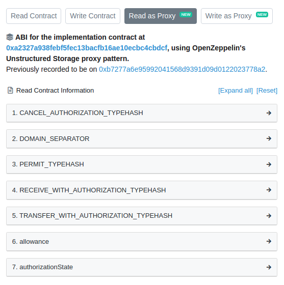

## EIP-1967 : Proxy Storage Slots
- 출처 : https://eips.ethereum.org/EIPS/eip-1967

## 차례
----
- [초록](#초록)
- [동기](#동기)
- [사양](#사양)
    - [로직 컨트랙트 주소](#로직-컨트랙트-주소)
    - [비콘 컨트랙트 주소](#비콘-컨트랙트-주소)
    - [관리자 주소](#관리자-주소)
- [이론적 근거](#이론적-근거)
- [참조 구현](#참조-구현)
- [보안 고려사항](#보안-고려사항)
- [저작권](#저작권)


### 초록
----
프록시 컨트랙트의 위임은 업그레이드 가능성과 가스 절약을 위해 사용됩니다. 이러한 프록시는 `delegatecall`을 사용하여 호출되는 (Implementation Contract 나 master copy 로 불리는) 로직 컨트랙트에 의존합니다. 이를 통해 코드가 로직 컨트랙트에 위임되는 동안, 프록시는 영구적인 상태(Storage 나 잔액)를 유지할 수 있습니다. 

프록시와 로직 컨트랙트 간의 Storage 사용에 있어 충돌을 방지하기 위해, 로직 컨트랙트 주소는 (예: 오픈제플린 컨트랙트의 `0x360894a13ba1a3210667c828492db98dca3e2076cc3735a920a3ca505d382bbc`과 같이) 컴파일러에 의해 할당되지 않도록 보장된 특정 Storage Slot에 저장됩니다. 본 EIP는 프록시 정보를 저장하기 위한 표준 Slot을 제안합니다. 이를 통해 블록탐색기와 같은 클라이언트는 이 정보를 적절히 추출하여 사용자에게 보여주고, 로직 컨트랙트는 선택적으로 동작할 수 있습니다. 

### 동기
----
프록시 위임은 업그레이드를 지원하고 배포에 드는 가스 비용을 줄이기 위한 수단으로 널리 사용되고 있습니다. 이러한 프록시의 예로는 Openzeppelin 컨트랙트, Gnosis, AragonOS, Melonport, Limechain, WindingTree, Decentraland 등이 있습니다.

그러나 프록시의 로직 주소를 얻기 위한 공통 인터페이스가 없기 때문에 이 정보에 따라 작동하는 공통 도구를 구축하는 것이 불가능합니다.

대표적인 예가 블록 탐색기입니다. 여기서 사용자는 프록시 자체가 아닌 기본 로직 컨트랙트와 상호작용하기를 원합니다. 프록시에서 로직 컨트랙트 주소를 검색하는 일반적인 방법이 있으면 블록 탐색기는 프록시가 아닌 로직 컨트랙트의 ABI를 표시할 수 있습니다. 탐색기는 구별된 슬롯에서 컨트랙트의 Storage를 확인하여 실제 프록시인지 확인하며, 이 경우 프록시와 로직 컨트랙트 모두에 대한 정보를 표시합니다. 예를 들어 `0xa0b86991c6218b36c1d19d4a2e9eb0ce3606eb48`이 이더스캔에 표시되는 방식입니다:



또 다른 예로는 명시적으로 프록시되는 로직 컨트랙트가 있습니다. 즉, 로직의 일부로써 코드가 업데이트 될 수 있습니다. 공통 Storage Slot은 특정 프록시 구현과 무관하게 사용될 수 있도록 허용합니다. 

### 사양
----
프록시 모니터링은 많은 어플리케이션의 보안에 필수입니다. 따라서, 구현과 관리 Slot의 변경 사항을 추적할 수 있는 기능이 필수입니다. 불행히도, Storage Slot의 변경 추적은 쉽지 않습니다. 따라서, Slot을 변경하는 모든 함수에서 해당 이벤트도 발생시켜야 합니다. 여기에는, 0x00 에서 0 이 아닌 첫번째 값으로의 초기화도 포함됩니다. 

프록시 정보를 위해 제안하는 Storage Slot은 다음과 같습니다. 필요에 따라, 후속 ERC에서 추가정보를 위한 Slot을 추가할 수 있습니다. 

### 로직 컨트랙트 주소

Storage Slot은 `0x360894a13ba1a3210667c828492db98dca3e2076cc3735a920a3ca505d382bbc` 입니다.
(구체적으로 `bytes32(uint256(keccak256('eip1967.proxy.implementation')) - 1)` 입니다.)

(Storage Slot에는) 프록시가 위임하는 로직 컨트랙트 주소가 저장됩니다. 비콘을 대신 사용하는 경우, (Storage Slot은) 비어있어야 합니다. 이 Slot에 대한 변경 사항은 이벤트로 통보해야 합니다. 

> event Upgraded(address indexed implementation);

### 비콘 컨트랙트 주소

Storage Slot은 `0xa3f0ad74e5423aebfd80d3ef4346578335a9a72aeaee59ff6cb3582b35133d50` 입니다.
(구체적으로 `bytes32(uint256(keccak256('eip1967.proxy.beacon')) - 1)` 입니다.)

(Storage Slot에는) 프록시가 의존하는 (fallback 하는) 비콘 컨트랙트 주소가 저장됩니다. 로직 컨트랙트를 직접 사용하는 경우, (Storage Slot은) 비어있어야 하고, 로직 컨트랙트 Slot이 비어있는 경우에만 고려합니다. 이 Slot에 대한 변경 사항은 이벤트로 통보해야 합니다. 

> event BeaconUpgraded(address indexed beacon);

비콘은 단일 위치에 여러 프록시의 로직 컨트랙트 주소를 저장하는데 사용하며, 단일 Storage Slot을 변경하여 여러 프록시를 업그레이드 할 수 있습니다. 비콘 컨트랙트는 반드시 이 기능을 구현해야 합니다. 

> function implementation() returns (address)

프록시 컨트랙트를 기반으로 한 비콘은 로직 컨트랙트 Slot을 사용하지 않습니다. 대신, 비콘 컨트랙트 Slot을 사용해 비콘 주소를 저장합니다. 비콘 프록시가 사용하는 로직 컨트랙트를 알기 위해서는 클라이언트를 알아야 합니다.

- 비콘 로직 Storage Slot에 대한 비콘 주소를 읽습니다. 
- 비콘 컨트랙트에서 `implementation()` 함수를 호출합니다. 

비콘 컨트랙트에서 `implementation()` 함수의 결과는 호출자(`msg.sender`)에 의존하지 않아야 합니다.


### 관리자 주소

Storage Slot은 `0xb53127684a568b3173ae13b9f8a6016e243e63b6e8ee1178d6a717850b5d6103` 입니다.
(구체적으로 `bytes32(uint256(keccak256('eip1967.proxy.admin')) - 1)` 입니다.)

이 프록시에 대한 로직 컨트랙트 주소를 업그레이드 할 수 있는 주소를 저장합니다. (선택사항) 이 Slot에 대한 변경 사항은 이벤트로 통보해야 합니다.

> event AdminChanged(address previousAdmin, address newAdmin);


### 이론적 근거
----
본 EIP는 프록시 컨트랙트의 공개 방식 대신 로직 컨트랙트 주소의 Storage Slot을 표준화합니다. 이 이유는 로직 컨트랙트 함수와 충돌할 수 있는 함수를 사용자에게 노출해서는 안되기 떄문입니다. 

ABI는 함수셀렉터가 4Bytes만을 사용하므로, 다른 이름의 함수간에도 충돌할 수 있습니다. 프록시는 호출을 가로채 자체 값으로 응답하기 때문에, 프록시 컨트랙트 호출 결과 예상과 다른 값을 반환하는 예가치 않은 오류 또는 취약점을 야기할 수 있습니다 

다음은 Nomic Labs의 이더리움 프록시 악성 백도어에서 발췌한 내용입니다. 

> 프록시 컨트랙트 함수가 구현 컨트랙트 함수와 일치하는 경우, 프록시 컨트랙트 함수를 호출합니다. 
> 
> 함수 셀렉터가 고정된 크기를 사용하기 떄문에, (잠재적으로) 충돌 가능성이 있습니다. 솔리디티 컴파일러가 컨트랙트 내 셀렉터 충돌을 탐지하기 때문에, 일상적인 개발에는 문제되지 않습니다. 그러나, 컨트랙트 간 상호 작용에 셀렉터가 사용될 경우 악용될 수 있습니다. 충돌을 악용하여 겉보기에는 정상적으로 작동하는 컨트랙트를 만들 수 있지만 실제로는 백도어를 숨기고 있을 수 있습니다.

이 점은 프록시 공개 함수가 (잠재적으로) 악용될 수 있기 때문에, 로직 컨트랙트 주소를 다른 방식으로 표준화할 필요가 있습니다. 

선택적 Storage Slot의 주요 요건은 컴파일러가 컨트랙트 상태 변수를 저장하기 위해 (Storage Slot을) 선택해서는 안된다는 것입니다. 그렇지 않으면, 로직 컨트랙트가 자체 변수에 쓸 때, 프록시에서 덮어쓸 수 있습니다. 

솔리디티는 컨트랙트 상속 체인을 선형화한 후, (첫번째 변수는 첫번째 Slot에) 선언한 순서에 따라, Storag에 변수를 매핑합니다. 키에 연결된 해시의 Storage Slot에 저장되는 동적 배열과 매핑은 예외입니다. 솔리디티 개발팀은 Storage 레이아웃이 새로운 버전에서도 유지될 것임을 확인했습니다. 

> Storage 포인터를 라이브버리에 전달할 수 있기 때문에, Storage의 상태변수 레이아웃은 솔리디티 외부 인터페이스의 일부로 간주합니다. 즉, 이 섹션에 설명한 규칙에 대한 변경은 언어의 중요한 변경으로 간주되므로, 실행하기 전 매우 신중하게 고려해야 합니다. 이러한 변경이 발생하는 경우, 컴파일러가 생성한 바이트코드가 이전 버전의 레이아웃과 호환되로록 릴리즈해야 합니다. 

바이퍼는 솔리디티와 동일한 전략을 따릅니다. 다른 언어로 개발된 컨트랙트나 어셈블리에서 충돌이 발생할 수 있다는 점을 유의해야 합니다. 

이러한 컨트랙트는 Storage Index로 시작하지 않는 문자열의 해시에 의존하기 때문에 컴파일러가 할당한 상태 변수와 충돌하지 않도록 보장해야 합니다. 또한, a-1 오프셋이 추가되어 해시의 이전 이미지를 알 수 없으므로 공격 가능성을 더욱 줄일 수 있습니다. 


### 참조 구현
----
```
/**
 * @dev This contract implements an upgradeable proxy. It is upgradeable because calls are delegated to an
 * implementation address that can be changed. This address is stored in storage in the location specified by
 * https://eips.ethereum.org/EIPS/eip-1967[EIP1967], so that it doesn't conflict with the storage layout of the
 * implementation behind the proxy.
 */
contract ERC1967Proxy is Proxy, ERC1967Upgrade {
    /**
     * @dev Initializes the upgradeable proxy with an initial implementation specified by `_logic`.
     *
     * If `_data` is nonempty, it's used as data in a delegate call to `_logic`. This will typically be an encoded
     * function call, and allows initializing the storage of the proxy like a Solidity constructor.
     */
    constructor(address _logic, bytes memory _data) payable {
        assert(_IMPLEMENTATION_SLOT == bytes32(uint256(keccak256("eip1967.proxy.implementation")) - 1));
        _upgradeToAndCall(_logic, _data, false);
    }

    /**
     * @dev Returns the current implementation address.
     */
    function _implementation() internal view virtual override returns (address impl) {
        return ERC1967Upgrade._getImplementation();
    }
}

/**
 * @dev This abstract contract provides getters and event emitting update functions for
 * https://eips.ethereum.org/EIPS/eip-1967[EIP1967] slots.
 */
abstract contract ERC1967Upgrade {
    // This is the keccak-256 hash of "eip1967.proxy.rollback" subtracted by 1
    bytes32 private constant _ROLLBACK_SLOT = 0x4910fdfa16fed3260ed0e7147f7cc6da11a60208b5b9406d12a635614ffd9143;

    /**
     * @dev Storage slot with the address of the current implementation.
     * This is the keccak-256 hash of "eip1967.proxy.implementation" subtracted by 1, and is
     * validated in the constructor.
     */
    bytes32 internal constant _IMPLEMENTATION_SLOT = 0x360894a13ba1a3210667c828492db98dca3e2076cc3735a920a3ca505d382bbc;

    /**
     * @dev Emitted when the implementation is upgraded.
     */
    event Upgraded(address indexed implementation);

    /**
     * @dev Returns the current implementation address.
     */
    function _getImplementation() internal view returns (address) {
        return StorageSlot.getAddressSlot(_IMPLEMENTATION_SLOT).value;
    }

    /**
     * @dev Stores a new address in the EIP1967 implementation slot.
     */
    function _setImplementation(address newImplementation) private {
        require(Address.isContract(newImplementation), "ERC1967: new implementation is not a contract");
        StorageSlot.getAddressSlot(_IMPLEMENTATION_SLOT).value = newImplementation;
    }

    /**
     * @dev Perform implementation upgrade
     *
     * Emits an {Upgraded} event.
     */
    function _upgradeTo(address newImplementation) internal {
        _setImplementation(newImplementation);
        emit Upgraded(newImplementation);
    }

    /**
     * @dev Perform implementation upgrade with additional setup call.
     *
     * Emits an {Upgraded} event.
     */
    function _upgradeToAndCall(
        address newImplementation,
        bytes memory data,
        bool forceCall
    ) internal {
        _upgradeTo(newImplementation);
        if (data.length > 0 || forceCall) {
            Address.functionDelegateCall(newImplementation, data);
        }
    }

    /**
     * @dev Perform implementation upgrade with security checks for UUPS proxies, and additional setup call.
     *
     * Emits an {Upgraded} event.
     */
    function _upgradeToAndCallSecure(
        address newImplementation,
        bytes memory data,
        bool forceCall
    ) internal {
        address oldImplementation = _getImplementation();

        // Initial upgrade and setup call
        _setImplementation(newImplementation);
        if (data.length > 0 || forceCall) {
            Address.functionDelegateCall(newImplementation, data);
        }

        // Perform rollback test if not already in progress
        StorageSlot.BooleanSlot storage rollbackTesting = StorageSlot.getBooleanSlot(_ROLLBACK_SLOT);
        if (!rollbackTesting.value) {
            // Trigger rollback using upgradeTo from the new implementation
            rollbackTesting.value = true;
            Address.functionDelegateCall(
                newImplementation,
                abi.encodeWithSignature("upgradeTo(address)", oldImplementation)
            );
            rollbackTesting.value = false;
            // Check rollback was effective
            require(oldImplementation == _getImplementation(), "ERC1967Upgrade: upgrade breaks further upgrades");
            // Finally reset to the new implementation and log the upgrade
            _upgradeTo(newImplementation);
        }
    }

    /**
     * @dev Storage slot with the admin of the contract.
     * This is the keccak-256 hash of "eip1967.proxy.admin" subtracted by 1, and is
     * validated in the constructor.
     */
    bytes32 internal constant _ADMIN_SLOT = 0xb53127684a568b3173ae13b9f8a6016e243e63b6e8ee1178d6a717850b5d6103;

    /**
     * @dev Emitted when the admin account has changed.
     */
    event AdminChanged(address previousAdmin, address newAdmin);

    /**
     * @dev Returns the current admin.
     */
    function _getAdmin() internal view returns (address) {
        return StorageSlot.getAddressSlot(_ADMIN_SLOT).value;
    }

    /**
     * @dev Stores a new address in the EIP1967 admin slot.
     */
    function _setAdmin(address newAdmin) private {
        require(newAdmin != address(0), "ERC1967: new admin is the zero address");
        StorageSlot.getAddressSlot(_ADMIN_SLOT).value = newAdmin;
    }

    /**
     * @dev Changes the admin of the proxy.
     *
     * Emits an {AdminChanged} event.
     */
    function _changeAdmin(address newAdmin) internal {
        emit AdminChanged(_getAdmin(), newAdmin);
        _setAdmin(newAdmin);
    }

    /**
     * @dev The storage slot of the UpgradeableBeacon contract which defines the implementation for this proxy.
     * This is bytes32(uint256(keccak256('eip1967.proxy.beacon')) - 1)) and is validated in the constructor.
     */
    bytes32 internal constant _BEACON_SLOT = 0xa3f0ad74e5423aebfd80d3ef4346578335a9a72aeaee59ff6cb3582b35133d50;

    /**
     * @dev Emitted when the beacon is upgraded.
     */
    event BeaconUpgraded(address indexed beacon);

    /**
     * @dev Returns the current beacon.
     */
    function _getBeacon() internal view returns (address) {
        return StorageSlot.getAddressSlot(_BEACON_SLOT).value;
    }

    /**
     * @dev Stores a new beacon in the EIP1967 beacon slot.
     */
    function _setBeacon(address newBeacon) private {
        require(Address.isContract(newBeacon), "ERC1967: new beacon is not a contract");
        require(
            Address.isContract(IBeacon(newBeacon).implementation()),
            "ERC1967: beacon implementation is not a contract"
        );
        StorageSlot.getAddressSlot(_BEACON_SLOT).value = newBeacon;
    }

    /**
     * @dev Perform beacon upgrade with additional setup call. Note: This upgrades the address of the beacon, it does
     * not upgrade the implementation contained in the beacon (see {UpgradeableBeacon-_setImplementation} for that).
     *
     * Emits a {BeaconUpgraded} event.
     */
    function _upgradeBeaconToAndCall(
        address newBeacon,
        bytes memory data,
        bool forceCall
    ) internal {
        _setBeacon(newBeacon);
        emit BeaconUpgraded(newBeacon);
        if (data.length > 0 || forceCall) {
            Address.functionDelegateCall(IBeacon(newBeacon).implementation(), data);
        }
    }
}

/**
 * @dev This abstract contract provides a fallback function that delegates all calls to another contract using the EVM
 * instruction `delegatecall`. We refer to the second contract as the _implementation_ behind the proxy, and it has to
 * be specified by overriding the virtual {_implementation} function.
 *
 * Additionally, delegation to the implementation can be triggered manually through the {_fallback} function, or to a
 * different contract through the {_delegate} function.
 *
 * The success and return data of the delegated call will be returned back to the caller of the proxy.
 */
abstract contract Proxy {
    /**
     * @dev Delegates the current call to `implementation`.
     *
     * This function does not return to its internal call site, it will return directly to the external caller.
     */
    function _delegate(address implementation) internal virtual {
        assembly {
            // Copy msg.data. We take full control of memory in this inline assembly
            // block because it will not return to Solidity code. We overwrite the
            // Solidity scratch pad at memory position 0.
            calldatacopy(0, 0, calldatasize())

            // Call the implementation.
            // out and outsize are 0 because we don't know the size yet.
            let result := delegatecall(gas(), implementation, 0, calldatasize(), 0, 0)

            // Copy the returned data.
            returndatacopy(0, 0, returndatasize())

            switch result
            // delegatecall returns 0 on error.
            case 0 {
                revert(0, returndatasize())
            }
            default {
                return(0, returndatasize())
            }
        }
    }

    /**
     * @dev This is a virtual function that should be overridden so it returns the address to which the fallback function
     * and {_fallback} should delegate.
     */
    function _implementation() internal view virtual returns (address);

    /**
     * @dev Delegates the current call to the address returned by `_implementation()`.
     *
     * This function does not return to its internal call site, it will return directly to the external caller.
     */
    function _fallback() internal virtual {
        _beforeFallback();
        _delegate(_implementation());
    }

    /**
     * @dev Fallback function that delegates calls to the address returned by `_implementation()`. Will run if no other
     * function in the contract matches the call data.
     */
    fallback() external payable virtual {
        _fallback();
    }

    /**
     * @dev Fallback function that delegates calls to the address returned by `_implementation()`. Will run if call data
     * is empty.
     */
    receive() external payable virtual {
        _fallback();
    }

    /**
     * @dev Hook that is called before falling back to the implementation. Can happen as part of a manual `_fallback`
     * call, or as part of the Solidity `fallback` or `receive` functions.
     *
     * If overridden should call `super._beforeFallback()`.
     */
    function _beforeFallback() internal virtual {}
}

/**
 * @dev Library for reading and writing primitive types to specific storage slots.
 *
 * Storage slots are often used to avoid storage conflict when dealing with upgradeable contracts.
 * This library helps with reading and writing to such slots without the need for inline assembly.
 *
 * The functions in this library return Slot structs that contain a `value` member that can be used to read or write.
 */
library StorageSlot {
    struct AddressSlot {
        address value;
    }

    struct BooleanSlot {
        bool value;
    }

    struct Bytes32Slot {
        bytes32 value;
    }

    struct Uint256Slot {
        uint256 value;
    }

    /**
     * @dev Returns an `AddressSlot` with member `value` located at `slot`.
     */
    function getAddressSlot(bytes32 slot) internal pure returns (AddressSlot storage r) {
        assembly {
            r.slot := slot
        }
    }

    /**
     * @dev Returns an `BooleanSlot` with member `value` located at `slot`.
     */
    function getBooleanSlot(bytes32 slot) internal pure returns (BooleanSlot storage r) {
        assembly {
            r.slot := slot
        }
    }

    /**
     * @dev Returns an `Bytes32Slot` with member `value` located at `slot`.
     */
    function getBytes32Slot(bytes32 slot) internal pure returns (Bytes32Slot storage r) {
        assembly {
            r.slot := slot
        }
    }

    /**
     * @dev Returns an `Uint256Slot` with member `value` located at `slot`.
     */
    function getUint256Slot(bytes32 slot) internal pure returns (Uint256Slot storage r) {
        assembly {
            r.slot := slot
        }
    }
}
```

### 보안 고려사항
----

본 ERC는 선택적 Storage Slot은 컴파일어가 할당하지 않는다는 사실에 의존합니다. 이는 구현 컨트랙트가 프록시가 작동하는데 필요한 정보를 덮어쓰지 않도록 보장합니다. 따라서, 컴파일러가 할당하는 Slot과의 충돌을 피하기 위해, 높은 Slot번호가 선택되었습니다. 또한, 악의적으로 조작된 키로 매핑에 쓰면 엎어쓸 수 없도록 알려진 이전 이미지가 없는 위치가 선택되었습니다. 

프록시 특정 정보를 수정하려는 로직 컨트랙트는 특정 Storage Slot에 쓰기를 통해 의도적으로 수정해야 합니다(UUPS의 경우처럼).


### 저작권
----
[CC0](https://eips.ethereum.org/LICENSE)를 통해 저작권 및 관련 권리가 면제됩니다.


