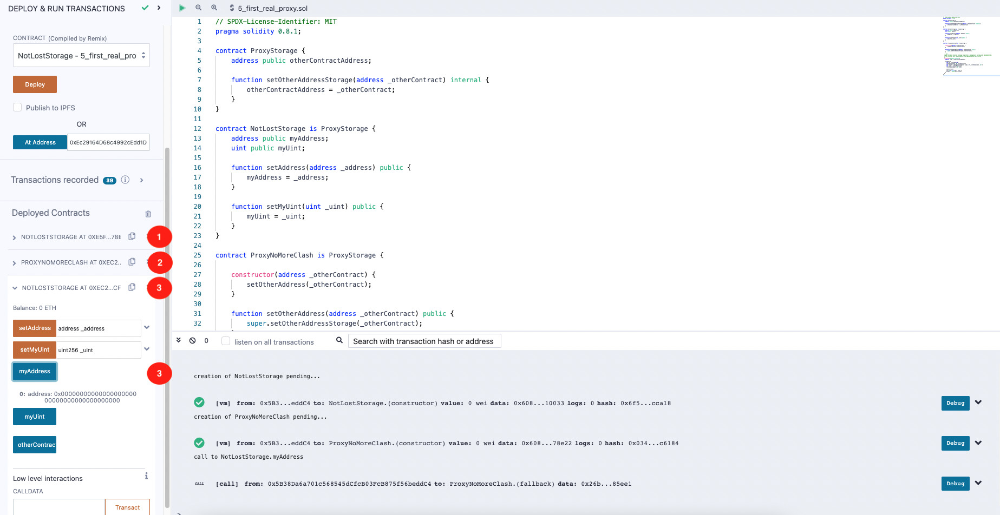

## EIP-897: The first real Proxy (번역_한글)
- 출처 : https://ethereum-blockchain-developer.com/110-upgrade-smart-contracts/07-eip-897-proxy/#eip-897-the-first-real-proxy

두 변수가 동일한 Storage Slot을 사용하는 것을 방지하려면 모든 컨트랙트가 프록시에 필요한 추가 Storage를 알고 있어야 합니다. 다시 말해 프록시를 위한 Storage 기능만 수행하는 별도의 스마트 컨트랙트가 있다면, 이를 LostStorage의 기본 컨트랙트로 사용할 수 있습니다.([코드](../5_first_real_proxy.sol))

[EIP-897](./erc_897_delegateProxy.md)을 살펴보면 aragonOS와 zeppelinOS의 구현을 참조하는 것을 볼 수 있습니다. 내부적으로는 이 샘플 구현이 여기(aragonOS 와 zeppelinOS)에 있습니다. 관리자만 업그레이드 등을 수행할 수 있도록 소유권과 같은 기능을 추가한 것입니다. 본질적으로 그게 다입니다. 끝입니다.

위와 같은 패턴입니다:

1. `NoLostStorage` 컨트랙트를 배포합니다. 
2. NoLostStorage 컨트랙트 주소를 사용해 ProxyNoMoreClash 컨트랙트를 배포합니다. 
3. NoLostStorage 컨트랙트가 ProxyNoMoreClash 컨트랙트에서 실행중임을 Remix 에게 알립니다. 
4. NoLostStorage 컨트랙트에서 myAddress() 를 호출합니다. 현재 0 이며 원하는 값을 설정할 수 있습니다. 

ProxyStorage 컨트랙트는 NoLostStorage 컨트랙트와 ProxyNoMoreClash 컨트랙트 모두에 상속되므로 컴파일러는 Storage Slot 0에서 다시 시작할 수 없다는 것을 알 수 있습니다. 더 이상 Storage Slot을 덮어쓰지 않습니다.

하지만 여기에는 몇 가지 단점도 있습니다.

#### 단점 : 컨트랙트 수정
이 솔루션은 처음에는 꽤 멋지게 들리지만, 이 접근 방식에는 분명한 단점이 있습니다. 업그레이드 가능한 모든 스마트 컨트랙트는 ProxyStorage 컨트랙트에서 확장해야만 작동합니다.

모든 스마트 컨트랙트를 직접 개발한다면 모든 스마트 컨트랙트에 ProxyStorage 컨트랙트를 추가할 수 있겠지만, 오픈제플린의 스마트 컨트랙트 패키지와 같이 표준화되면 점점 더 어려워질 수 있습니다.

그렇다면 이러한 스토리지 충돌을 피할 수 있는 다른 방법이 있다면 어떨까요?