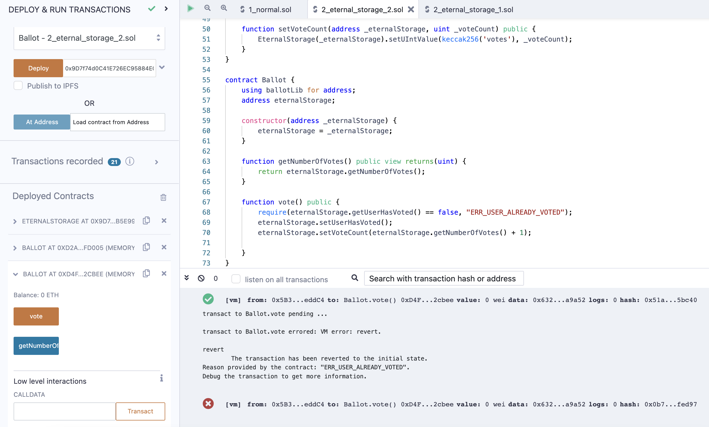

## Eternal Storage without Proxy (번역_한글)
- 출처 : https://ethereum-blockchain-developer.com/110-upgrade-smart-contracts/04-eternal-storage/

가장 먼저 해결해야 할 문제는 재배포 중 데이터 손실입니다. 가장 먼저 떠오르는 것은 로직과 스토리지를 분리하는 것입니다. 문제는 어떻게 그렇게 할 수 있을까요?

Eternal Storage 패턴에서는 setters와 getters가 있는 스토리지를 별도의 스마트 컨트랙트로 옮기고 로직 스마트 컨트랙트만 읽기/쓰기할 수 있도록 합니다.

이는 필요한 변수를 정확히 처리하는 스마트 컨트랙트일 수도 있고, 변수 유형별로 일반화할 수도 있습니다. 아래 예시를 통해 그 의미를 설명해드리겠습니다.

간단하게 설명하기 위해 엘레나 디미트로바가 예시에서 사용했던 것을 그대로 사용하겠습니다. 그러나 저는 이것을 크게 단순화하고 본질로 요약할 것입니다. 따라서 스마트 컨트랙트는 원격으로 완전하지는 않지만 내부에서 무슨 일이 일어나고 있는지 이해하는 데 가장 중요한 부분을 보여줍니다.

솔리디티 0.8.1로 포팅했습니다. ([코드](../2_eternal_storage_1.sol))

간단한 투표 스마트 컨트랙트입니다. `vote()`를 호출하면 숫자를 늘리는 기본적인 로직입니다.
먼저, Eternal Storage 를 배포합니다. 이 컨트랙트는 상수이며 변경되지 않습니다. 

그 다음 로직을 실행하는 라이브러리와 투표 컨트랙트를 배포합니다. 

내부적으로, 라이브러리는 delegatecall 을 수행해 투표 컨트랙트의 컨텍스트에서 라이브러리 코드를 실행합니다. 만약, 라이브러리에서 msg.sender 를 사용하면, 투표 컨트랙트와 동일한 값을 갖습니다. 

새 투표 인스턴스에서 몇번 투표하여 이를 테스트해 보겠습니다. 

모든 사람들이 원하는 만큼 투표할 수 있는 버그를 발견했다고 가졍해 보겠습니다. 버그를 수정하고 투표 스마트 컨트랙트만 다시 배포합니다. (이전 버전은 여전히 실행중이고 추가 코드없이는 중지할 방법이 없다는 점은 무시합니다.)

모든 코드는 다음 코드로 교페합니다.  강조된 부분이 실제 변경된 부분입니다. ([코드](../2_eternal_storage_2.sol))

보다시피, 라이브러리만 변경되었습니다. 스토리지는 이전과 동일합니다. 하지만, 업데이터는 어떻게 배포할까요? 

투표 컨트랙트를 다시 배포하고 스토리지 컨트랙트 주소를 제공하면 됩니다. 그게 전부입니다. 

스토리티 컨트랙트는 변경하지 않았으므로 다시 배포할 필요는 없습니다. 이미 존재하는 것을 사용하면 됩니다. 한번 더 투표하면, 화면과 같이 오류(3)이 표시됩니다.

엘레나의 원본 스마트 컨트랙트는 uint, bool 로 충분하지 않기 때문에, 몇가지 변수 유형이 더 있습니다. 

여기에는 몇가지 장단점이 있습니다. 

장점1) 비교적 이해하기 쉽습니다. 어셈블리를 실행하지 않습니다. 만약, 기존 소프트웨어 개발에 익숙하자면, 이러한 패턴은 상당히 익숙해 보일 것입니다.

장점2) 라이브러리가 없어도, 스토리지 스마트 컨트랙트만으로 동작합니다.

장점3) 컨트랙트 업데이트 후 스토리지 마이그레이션을 제거합니다. 

컨트랙트 주소 변경 - 투명성을 위해 좋습니다. 예를 들어, 온라인 서비스를 운영하고 신규 가입시 요금을 변경되는 경우.

단점1) 변수에 접속 패턴이 매우 어려운 경우

단점2) 토큰 등과 같은 기존 스마트 컨트랙트에서 바로 사용할 수 없습니다. 

단순하지만, 사용 사례에 따라, 매우 실용적인 솔루션입니다. 특히, 스마트 컨트랙트는 단순할 수록 좋습니다. 만약 실사례를 보고 싶다면, 모퍼닷컴(Morpher.com) 스마트 컨트랙트 모퍼상태(MorpherState) 와 모퍼토큰(MorpherToken) 을 확인하기 바랍니다. 두 스마트 컨트랙트는 단순히 gettes 와 setters 로 연결되지만, 효과는 동일합니다. 감사가 쉽고, 검색측면에서 내부에서 무슨일이 일어나는지 파악하기 쉽습니다. 

다른 많은 프로젝트는 업그레이드된 스마트 컨트랙트의 주소가 유지되는 프록시 패턴을 사용하고 있습니다. 

----
### 참고

* 샘플 코드
    - [eternal storage 1](../2_eternal_storage_1.sol)
    - [eternal storage 2](../2_eternal_storage_2.sol)
