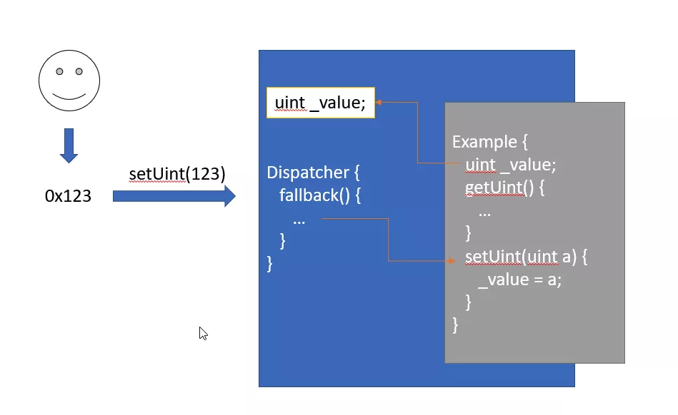
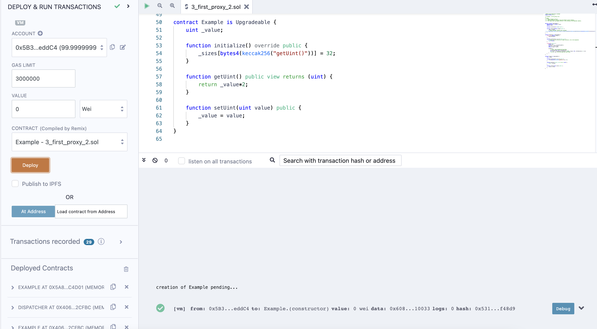

## First Proxy (번역_한글)
- 출처 : https://ethereum-blockchain-developer.com/110-upgrade-smart-contracts/05-proxy-nick-johnson/

(제가 알기로는) 최초로 제안된 프록시는 닉 존슨이 제안했다. 잘 모르시는 분들을 위해 소개하자면, 그는 이더리움 네임 서비스(ENS)의 창립자이자 수석 개발자입니다. 또한 그의 트위터를 확인해보면, 그는 꽤 활발하게 활동합니다. 그리고 그는 말 그대로 항상 한발 앞서 있습니다: 그는 뉴질랜드(GMT+13) 출신입니다.

프록시는 다음과 같습니다. 솔리디티 버전은 함수 가시성 지정자와 실제 프래그마 라인이 필요하기 때문에, 솔리디티 0.4.0 (또는 유사 버전) 으로 작성된 것으로 보입니다. 

따라서 다음은 동일한 스마트 컨트랙트를 솔리디티 0.8.1로 포팅하고 모든 주석과 대체 메서드를 제거하여 실제로 스마트 컨트랙트를 대체할 수 있도록 공개한 사본입니다. 다시 말하지만, 이는 거버넌스나 제어 기능이 없는 단순화된 버전으로 업그레이드 아키텍처를 보여줄 뿐입니다 ([코드](../3_first_proxy_1.sol))

그럼 여기서 무슨 일이 일어나고 있을까요? 컨트랙트를 시도하기 전에 fallback 함수의 어셈블리에 대해 간단히 설명하겠습니다.

기본적으로 예시 스마트 컨트랙트에 대한 delegatecall 이 일어납니다. 그런데 delegatecall 이란 무엇일까요?

```
솔리디티 문서 내 DelegateCall

메시지 호출의 특별 버전인 delegatecall 은 대상 주소의 코드가 호출한 컨트랙트 컨텍스트에서 실행되고 msg.sender 와 msg.value 가 변경되지 않는다는 점을 제외하면 메시지 호출과 동일하다
```

즉, 대상 컨트랙트 주소에서 대상 컨트랙트의 코드를 실행하는 대신, 대상을 호출한 컨트랙트에서 대상 컨트랙트의 코드를 실행한다. 

한 번 해보시면 어떻게 되는지 알 수 있을 것입니다:

1. Example 컨트랙트를 배포한다. 


2. Example 컨트랙트 주소로 Dispatcher 컨트랙트를 배포한다. 


3. Example 컨트랙트가 이제 Dispatcher 주소에서 실행 중이라고 Remix에 알립니다.


```
스토리지 위치

주의 : 업그레이드 가능한 컨트랙트의 대상 주소가 스토리지 슬롯 0에 있기 때문에 이 구현만 작동합니다. 다른 구현이 왜 mload(0x40)을 사용하는지, 여기서 스토리지 포인터에 어떤 일이 일어나는지 궁금하다면, 이에 대해 매우 친절하게 설명하는 OpenZeppelin의 다음 [가이드](https://blog.openzeppelin.com/proxy-patterns)를 확인해 보세요.
```
Example-Dispatcher 컨트랙트에서, Uint를 설정하고 Uint를 받습니다. 변수가 정확하게 저장되지만, Dispatcher는 setUint, getUint 함수를 알지 못합니다. 또한 Example에서 상속하지도 않는다. 


이는 기본적으로 Dispatcher를 스토리지처럼 사용하지만, Example 컨트랙트에 저장된 로직을 사용하여 일어나는 일을 제오합니다. Dispatcher가 Example 컨트랙트와 "대화"하는 대신, Example 컨트랙트 코드가 Dispatcher 범위로 이동해 실행하고 Dispatcher 저장소를 변경한다. 이는 이전의 EternalStorage 패턴과 큰 차이점입니다.



`delegatecall` op-code는 Example 컨트랙트를 Dispatcher 로 이동하고 Dispatcher 스토리지를 사용합니다.
이는 first proxy 구현의 훌륭한 예시입니다. 특히, 솔리디티 개발 초창기라는 점을 고려하면, 상당히 앞선 생각입니다. 
getUint() 에서 uint * 2 결과를 반환하는 스마트 컨트랙트로 업그래이드 하고 싶다고 가정해 보겠습니다. ([코드](../3_first_proxy_2.sol))

`replace` 메소드를 사용해 로직 컨트랙트를 업그레이드하는 방법입니다.

1. 예를 들어, getUint() 가 value * 2 를 반환하도록 Example 컨트랙트를 업데이트합니다. 

2. Example 컨트랙트를 배포합니다.



3. 배포된 Example 컨트랙트 주소를 복사합니다. 

4. 새로운 Example 컨트랙트 주소로 Dispatcher 의 `replace` 를 호출합니다. 


분명 내부적으로 많은 일이 있습니다. 그리고 이것이 전체 이야기의 끝은 아니지만, 내부적으로 Proxy가 동작하는 방식의 시작입니다.
하지만 Dispatcher를 사용하는 모든 컨트랙트의 업그레이드 가능한 스마트 컨트랙트에서 확장해야 하며, 그렇지 않으면 스토리지 충돌이 발생할 수 있다는 단점이 있습니다. 
