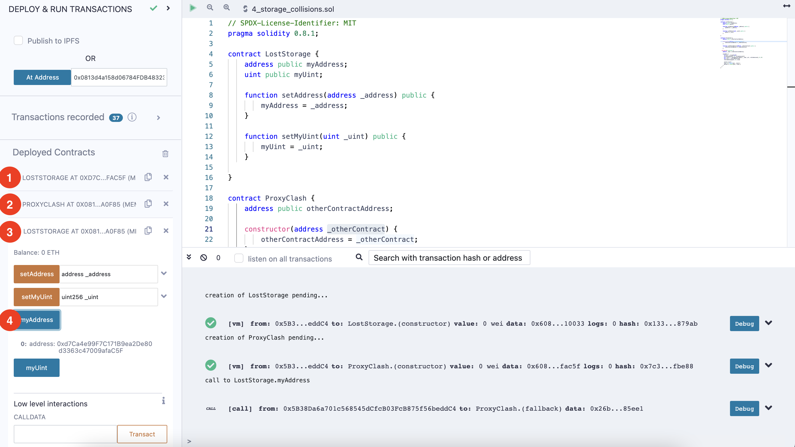

## Understanding Storage and Storage Collisions (번역_한글)
- 출처 : https://ethereum-blockchain-developer.com/110-upgrade-smart-contracts/06-storage-collisions/

하나는 프록시 패턴인 두 개의 스마트 컨트랙트 세트를 사용해 보겠습니다. 프록시에서 저장소가 첫 번째 변수와 어떻게 충돌하는지 잠시 후에 확인하실 수 있습니다.

이 컨트랙트를 복사하여 Remix에 붙여넣습니다 ([코드](../4_storage_collisions.sol))

이 Fallback 함수는 이전 함수보다 약간 더 복잡해 보이지만, 본질적으로 동일한 기능을 수행합니다. 여기에서도 값을 반환하고 대상 컨트랙트에 예외가 있는 경우 예외를 발생시킬 수 있습니다. 솔리디티 0.4와 0.8 이후 많은 일이 일어났습니다.

한 가지 큰 차이점은 LostStorage 컨트랙트가 Proxy를 상속하지 않는다는 것입니다. 따라서 내부적으로 Storage Layout이 분리되어 있고 둘 다 Storage Slot 0 에서 시작합니다.

이걸로 무엇을 할까요?

1. LostStorage 컨트랙트를 배포합니다. 
2. ProxyCrash 컨트랙트를 배포하고, Constructor 매개변수로 LostStorage 컨트랙트 주소를 설정합니다. 
3. LostStorage 컨트랙트가 Proxy 주소에서 실행중이라고 Remix 에 알립니다. 
4. LostStorage 컨트랙트의 myAddress() 를 호출합니다. 놀랍게도 0 이 아닌 주소가 반환됩니다. 충돌이 발생한겁니다. 

이것이 바로 솔리디티 컴파일러가 Storage Slot이 어디에 사용되는지 알 수 있도록 Storage 컨트랙트로 상속을 수행하는 이유입니다. 그리고 나중에 이에 대한 우아한 해결책이 있다는 것을 알게 될 것입니다.

Proxy를 위한 첫 번째 EIP부터 시작해 보겠습니다!