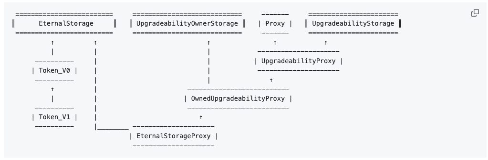

- 출처 : https://github.com/OpenZeppelin/openzeppelin-labs/tree/master/upgradeability_using_eternal_storage

이 접근 방식의 아이디어는 모든 컨트랙트에 대해 동일한 일반 스토리지 구조를 사용하여 컨트랙트의 동작을 업그레이드할 수 있도록 하는 것입니다. 이는 업그레이드 가능한 컨트랙트 내에서 액세스하거나 수정할 수 있는 각 유형 변수에 대한 매핑 집합입니다. 컨트랙트 개발자는 이 매핑의 저장소 구조에 따라서만 작업해야 한다는 점에 유의하세요.

이 접근 방식은 업그레이드할 수 있는 특정 구현에 대한 호출을 위임하는 프록시를 사용하여 스토리지 구조를 변경할 수 없게 만드는 것입니다. 프록시가 `delegatecall`을 사용하여 요청된 동작을 해결하면 업그레이드 가능한 컨트랙트의 상태는 프록시 컨트랙트 자체에 저장됩니다. 업그레이드 가능한 컨트랙트는 컨트랙트 소유자가 한 번만 초기화할 수 있습니다.

업그레이드 가능 메커니즘과 관련된 데이터와 토큰 컨트랙트 도메인과 엄격하게 관련된 두 가지 종류의 데이터가 있기 때문에, 여기서 무슨 일이 일어나고 있는지 정확하게 표현하기 위해 이름을 정하는 것이 매우 중요했습니다. 이것이 제안된 모델입니다:

`Proxy`, `UpgradeabilityProxy`, `UpgradeabilityStorage`는 프록시를 통해 업그레이드 가능성을 구현하는 데 사용할 수 있는 일반적인 콘트랙트입니다. 이 예시에서는 이 모든 컨트랙트를 사용하여 업그레이드 가능한 ERC20 토큰을 구현합니다.

`UpgradeabilityStorage` 컨트랙트는 업그레이드 가능성에 필요한 데이터를 보관하고, 업그레이드 가능성 소유권 추적에 필요한 상태 변수를 제공하는 `UpgradeabilityOwnerStorage`는 업그레이드 가능성에 필요한 데이터를 보관합니다. `EternalStorage`는 일반적인 스토리지 구조를 정의하며, 이 예시에서는 토큰 특정 데이터를 저장하는 데 사용됩니다.

`OwnedUpgradeabilityProxy`는 프록시, 업그레이드 가능성 및 소유 가능 기능을 결합하여 선언된 프록시 소유자만 버전 업그레이드 기능에 액세스할 수 있도록 제한하는 기능입니다.

`EternalStorageProxy`는 ERC20 토큰 동작의 특정 구현에 대한 호출을 위임하는 컨트랙트입니다. 이러한 동작은 토큰 개발자가 업그레이드할 수 있는 코드입니다(예: `Token_V0` 및 `Token_V1`). `EternalStorageProxy`는 `EternalStorage` 컨트랙트에서 확장된 다음 `OwnedUpgradeabilityProxy`에서 확장됩니다(이는 다시 `업그레이드 가능성 스토리지`와 `UpgradeabilityOwnerStorage`에서 확장됩니다). 스토리지 구조가 `EternalStorage`로부터만 상속되는 컨트랙트와 일치하도록 하려면 `EternalStorageProxy`가 먼저 `EternalStorage`로부터 상속되어야 한다는 점에 유의하세요.

또한 토큰 행동 구현 컨트랙트에서 새로운 상태 변수를 정의하지 않고 일반적인 스토리지 구조를 사용합니다. 이는 프록시 스토리지가 엉망이 되지 않도록 하기 위한 제안된 접근 방식의 요구 사항입니다.